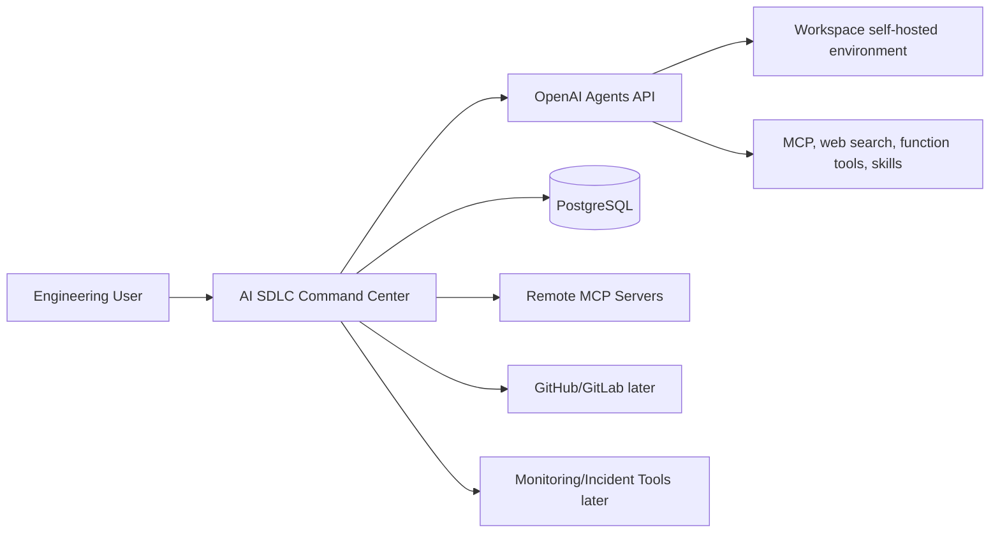
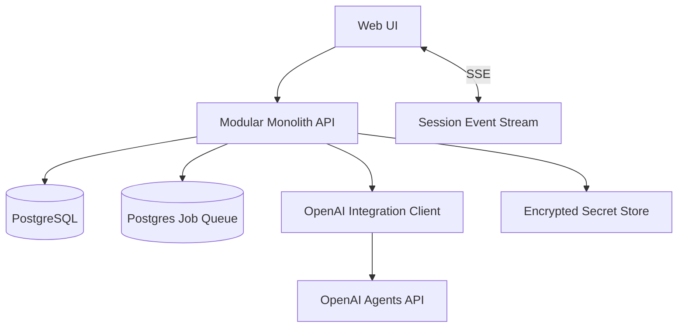
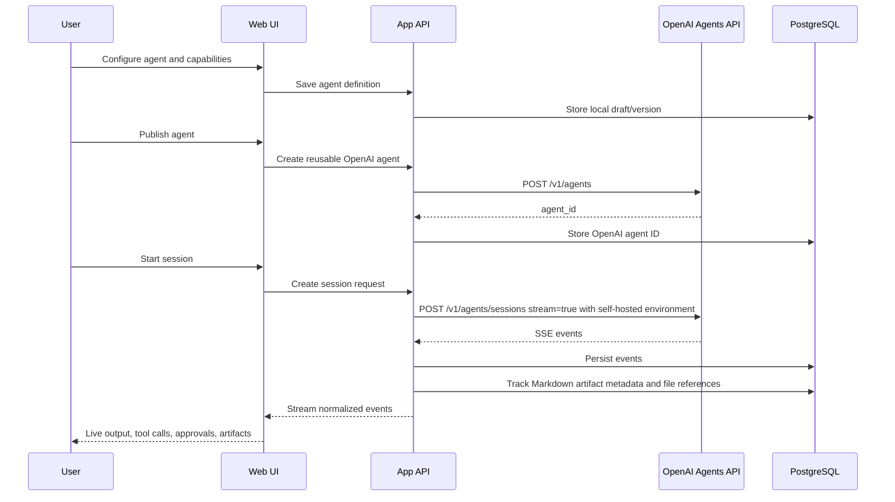

# Main Architecture

## Architecture Decision

Use a TypeScript modular monolith for R0.

The product is complex enough to need clear module boundaries, but not mature enough to justify distributed services. The safest shape is one deployable web application with explicit internal modules, one database, and a thin integration layer around OpenAI.

## Recommended Stack

### Frontend

- React with TypeScript
- Vite or Next.js frontend shell
- TanStack Query for server state
- Zustand for small client-side UI state
- React Flow for workflow and live fleet canvases
- Tailwind CSS with Radix UI primitives for accessible controls
- Monaco Editor or CodeMirror for JSON/config editing

### Backend

- Node.js with TypeScript
- NestJS or Fastify-based modular API
- PostgreSQL
- Prisma or Drizzle ORM
- Postgres-backed queue such as pg-boss for R0 async jobs
- Server-sent events for live session streams
- WebSocket later only if collaborative live editing requires it

### Auth and Security

- R0: workspace-level auth with email login or external provider.
- Use encrypted secret storage for OpenAI API keys and MCP credentials.
- Add SSO and SCIM later for enterprise.

### Deployment

- One web/API service
- One PostgreSQL database
- Optional background worker process using the same codebase
- Object storage later if the shared workspace filesystem is not enough for large artifacts

## Why Modular Monolith

The product needs speed and consistency more than service isolation.

Benefits:

- Simple deployment
- One database transaction boundary
- Easier local development
- Fewer distributed failure modes
- Clear module ownership without premature infrastructure
- Easier event streaming between OpenAI session handling and UI

Avoid microservices until:

- Multiple teams need independent deployments.
- Session streaming volume overwhelms the main app.
- Artifact processing becomes heavy.
- Capability execution needs separate trust boundaries.

## System Context

## Containers

## Module Boundaries

R0 modules:

1. Command Center Dashboard
2. Agent Registry
3. Capability Registry
4. Workspace Environment Settings
5. Workflow Orchestrator
6. Session Runner
7. Platform Chat
8. Observability and Governance

Each module owns its own use cases and tables. Cross-module access should go through service interfaces, not direct table access from random code.

## Data Ownership

| Data | Owning Module |
|---|---|
| Workspace settings | Observability and Governance |
| Agent definitions | Agent Registry |
| Agent versions | Agent Registry |
| MCP server configs | Capability Registry |
| Skill records | Capability Registry |
| Workspace environment settings | Workspace Environment Settings |
| Workflow definitions | Workflow Orchestrator |
| Workflow runs | Workflow Orchestrator |
| Sessions | Session Runner |
| Session events | Observability and Governance |
| Approvals | Observability and Governance |
| Platform chat threads | Platform Chat |
| Artifacts | Observability and Governance |
| Secrets | Observability and Governance with dedicated encryption boundary |

## Primary R0 Flow

## Key Quality Attributes

### Safety

- No hidden tool access.
- All capabilities attached by explicit reference.
- Risky actions require approval policies.
- Secrets are never exposed to the browser.
- OpenAI API keys are encrypted at rest.

### Observability

- Store every session, turn, event, tool call, error, approval, artifact reference, and effective run snapshot.
- Keep raw OpenAI event payloads when possible.
- Add normalized event projections for dashboard queries.

### Operability

- Dashboard must show active sessions, failed runs, pending approvals, and environment connection issues.
- Platform chat should answer status questions from local stored state before calling an LLM.

### Scalability

R0 scale target:

- Dozens of workspaces
- Hundreds of agents
- Thousands of sessions
- Live streaming for tens of concurrent sessions per workspace

This does not require distributed services.

## No-Gos for R0

- No Kafka.
- No microservices.
- No Kubernetes-first architecture.
- No custom agent runtime.
- No OpenAI-hosted R0 environments.
- No multiple environment profiles in R0.
- No replacing GitHub/Jira/Linear.
- No arbitrary shell execution from the app backend.
- No broad RBAC matrix before real roles stabilize.
- No complex visual workflow engine with arbitrary loops in R0.

## Deployment Shape

R0 can deploy as:

- Web/API app process
- Worker process from same codebase
- PostgreSQL

Optional later:

- Redis for high-volume ephemeral pub/sub
- Object storage for large artifact files if filesystem references become insufficient
- Dedicated streaming gateway
- Dedicated audit warehouse
